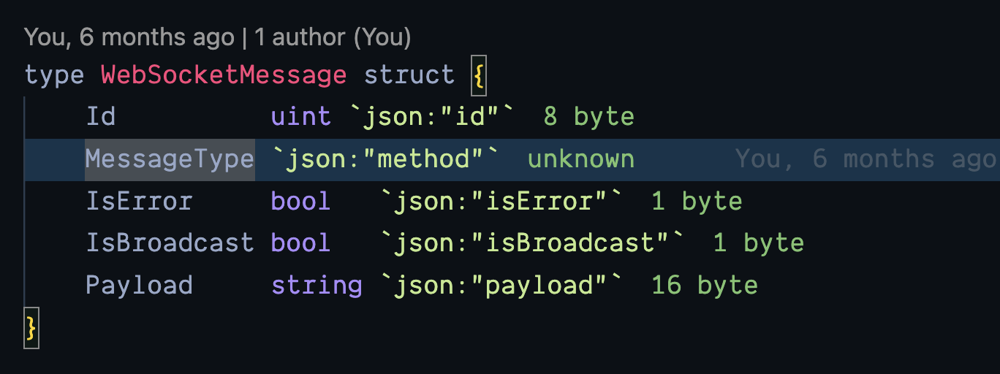

# Struct Size

Go Struct size is a vscode extension to print the size of fields in the struct. It will help you understand how much space your struct is going to take in the memory.
This is inspired by the famous vscode extension [import cost](https://github.com/wix/import-cost).

## Features

- Show size of fields in the struct



## Known Issues

Currently it is only supports calculating size of following data types -

```
bool
int/uint
int8/uint8
int16/uint16
int32/uint32
int64/uint64
float32/float64
```

It also calculates the size of string but it assumes that at least you will have a 16 byte of string size. Which is actually wrong.

# Goal

- [x] Support basic data types.
- [ ] Add offset of fields.
- [ ] Improve data type size calculation.
- [ ] Support more data type size calculation.
- [ ] Ability to re-organize the struct for optimal space in memory

# Contribution

Any and all kind of contribution are welcome.

## Release Notes

### 0.0.1

- Basic data types size calculation is supported.

# License

This project is under MIT License.
